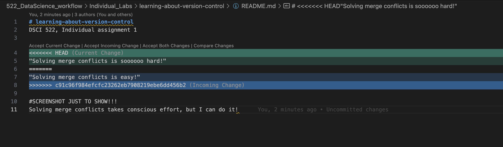

# Assignment 1 – Version Control

## 1. Commit History URL

https://github.com/will-chh/learning-about-version-control/commits/main/

## 2. Screenshot of Merge Conflict Resolution

## 3. Why branch + pull request workflow is useful

Working in a branch–pull-request workflow prevents accidental changes to the main branch and reduces the chance of breaking the project. It also makes it easier to review, discuss, and test changes before they get merged. This workflow is especially important when multiple collaborators are working on the same codebase.